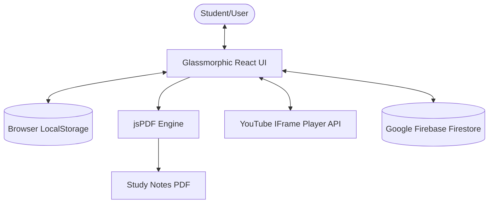
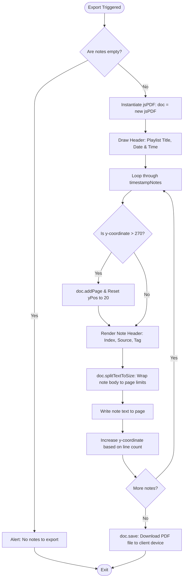

# 🧘 Focus Player README: System Architecture & Technical Specifications

Welcome to the **Focus Player README**. This document provides an exhaustive, line-by-line and architectural breakdown of the FocusPlayer codebase. FocusPlayer is a premium, glassmorphic productivity dashboard designed to facilitate distraction-free studying with YouTube playlists, complete with structured note-taking, progress tracking, local/cloud storage segregation, and automated reporting.

---

## 🏗️ 1. Architecture Overview (Frontend vs. Backend)

FocusPlayer is architected as a **Single Page Application (SPA)** designed with a client-centric, hybrid storage approach. It minimizes server dependencies to guarantee performance, zero latency, and absolute privacy for student study logs.



### 🖥️ The Frontend (Client-Side)
- **Framework & Tooling**: Built on **React 19** and bundled using **Vite 8** for ultra-fast Hot Module Replacement (HMR) and development compilation.
- **Styling**: Leverages vanilla CSS3 variables located in [index.css](file:///c:/Users/sahil/OneDrive/Desktop/FocusPlayer/src/index.css) to build a sophisticated **Glassmorphic** design system (frosted glass elements, blurred overlays, linear gradients, and dynamic light/dark mode transitions).
- **Core Libraries**:
  - `jspdf` for local document generation.
  - `recharts` for rendering svg-based vector progress charts.
  - YouTube IFrame API for deep media playback tracking.

### 🌐 The Backend (Serverless Cloud)
- **Google Firebase Firestore**: Used *exclusively* for the public **Community Feedback & Discussion** feature.
- **Why Firestore?** It provides instant, real-time syncing of public ratings and student messages without requiring an expensive server-side application layer.
- **Anonymous Model**: FocusPlayer enforces **no logins/no credentials** to reduce student friction, storing only standard public records in Firestore.

---

## 📦 2. Codebase Organization & Component Directory

Here is the source directory structure for FocusPlayer:

```
src/
├── components/
│   ├── AmbientSounds.jsx       # Rain sounds generator
│   ├── AnalyticsModal.jsx      # Recharts dashboard rendering
│   ├── FeedbackModal.jsx       # Firebase Firestore reviewer
│   ├── FocusTimer.jsx          # Focus timer entry point
│   ├── FocusTimerElements.jsx  # Pomodoro calculations, sidebar, badge
│   ├── InputBox.jsx            # YouTube URL search box
│   ├── Player.jsx              # YouTube IFrame wrapper
│   ├── Playlist.jsx            # Queue item list component
│   ├── Timer.jsx               # Circular playlist progress & playback
│   └── TodoList.jsx            # Checked list component
├── hooks/
│   └── useAnalytics.js         # Playback state tracking hook
├── utils/
│   └── extractPlaylist.js      # URL parser regex
├── firebase.js                 # Database configuration
├── App.jsx                     # Top-level state coordinator
├── App.css                     # Local CSS styling rules
├── index.css                   # Global variables and design system
└── main.jsx                    # React bootstrap entry point
```

---

## 💾 3. Data Storage Architecture ("The Boxes")

A critical component of FocusPlayer is how data is stored. FocusPlayer divides data storage into **Local Storage** and **Cloud Storage** to maintain student privacy.

### A. Local Storage (100% Client-Side Private Storage)
Private data is saved in the browser's `localStorage`. This data **never leaves the computer**. It remains saved when refreshing or closing the browser but is cleared if site cookies/cache are deleted.

| Feature / Box | key | Data Format | Description |
| :--- | :--- | :--- | :--- |
| **To-Do Tasks** | `focus_todos` | JSON Array | Array of objects: `[{ id: 1716..., text: "Learn React", done: false }]`. Managed by [TodoList.jsx](file:///c:/Users/sahil/OneDrive/Desktop/FocusPlayer/src/components/TodoList.jsx). |
| **Study Notes** | `timestampNotes` | JSON Array | Array of timestamped items: `[{ text: "Intro", time: "2:15", seconds: 135, videoIndex: 0, tag: "Code" }]`. |
| **Quick Draft** | `notes` | String | Draft note text written in the active notepad before saving. |
| **Selected Tag** | `noteTag` | String | Categories filter string (`None`, `Important`, `Code`, or `Review`). |
| **UI Theme** | `theme` | String | Theme selection (`light` or `dark`). Syncs directly to `<html class="...">`. |
| **Analytics Log** | `focus_analytics`| JSON Object | Accumulated statistics: `{"watchTime": 0, "completedVideos": 0, "streak": 0, "dailyWatchTime": {}}`. |

### B. Cloud Database (Firebase Firestore)
Only the **Community Feedback** section transmits data to the cloud.
- **Provider**: Google Firebase Firestore
- **Configuration Location**: [firebase.js](file:///c:/Users/sahil/OneDrive/Desktop/FocusPlayer/src/firebase.js)
- **Collection Name**: `feedbacks`
- **Data Properties**:
  - `name` (String): Custom text or defaults to `"Anonymous Student"`
  - `rating` (Number): User choice of `1` to `5` stars
  - `message` (String): Review text description
  - `date` (String): Formatted locale date string
  - `timestamp` (FieldValue): Server-level timestamp used for ordering messages descendingly
- **Firestore Security Rules Setup**: For this public feedback board to work, the Firestore database should be deployed in **Test Mode** (allowing read/write operations without user authentication tokens).

---

## 📄 4. PDF Generation Pipeline

Students can export their timestamped notes as a PDF document. This feature is written inside [App.jsx](file:///c:/Users/sahil/OneDrive/Desktop/FocusPlayer/src/App.jsx#L46-L90) and uses `jsPDF`.

Here is how the export function works under the hood:



### Technical Highlights of PDF Rendering:
1. **Dynamic Pagination Check**: The PDF canvas height is `297mm` (A4 size). To prevent text from running off the bottom, the script measures the vertical cursor position `yPos`. If `yPos > 270`, it triggers `doc.addPage()` and resets the cursor back to the top (`yPos = 20`).
2. **Auto-Wrapped Text Boundaries**: Long paragraphs will overflow off the right edge of a PDF. FocusPlayer fixes this using `doc.splitTextToSize(note.text, pageWidth - 20)`. This utility automatically splits a single long string into an array of strings formatted to fit within the specified margins.
3. **Adaptive Spacing**: The vertical space increases dynamically based on text volume using the equation: `yPos += (lines.length * 6) + 6`.

---

## 🔗 5. Third-Party Integrations & APIs

### 1. YouTube IFrame Player API
FocusPlayer embeds the YouTube media player using an iframe created dynamically in [Player.jsx](file:///c:/Users/sahil/OneDrive/Desktop/FocusPlayer/src/components/Player.jsx).
- **Initialization**: Appends `https://www.youtube.com/iframe_api` to the HTML `<body>` if it is not already loaded.
- **Event Listeners**: Listens to `onReady` events to export the reference object (`event.target`) to parent states.
- **Controls Integration**: Subcomponents (like [Playlist.jsx](file:///c:/Users/sahil/OneDrive/Desktop/FocusPlayer/src/components/Playlist.jsx) and [Timer.jsx](file:///c:/Users/sahil/OneDrive/Desktop/FocusPlayer/src/components/Timer.jsx)) call player methods:
  - `.getPlaylist()`: Fetches the list of all video IDs in the active queue.
  - `.getPlaylistIndex()`: Identifies the active playing video position.
  - `.playVideoAt(index)`: Skips directly to a specific video in the list.
  - `.seekTo(seconds)`: Seeks to a precise timestamp. Used when clicking custom notes to jump back or forward in time.
  - `.getPlayerState()`: Returns `1` (playing), `2` (paused), `0` (ended), or `-1` (unstarted) to drive analytics tracking.

### 2. Noembed API
FocusPlayer fetches playlist metadata without requiring a private YouTube Data API Key.
- **Target URL**: `https://noembed.com/embed?url=https://www.youtube.com/playlist?list=${id}`
- **Usage**: When a playlist link is pasted, FocusPlayer issues a fetch request. The proxy service returns public details (such as the playlist title), which is displayed in the page header.

---

## 📊 6. Productivity Tracker & Analytics Hook

The statistics tracker is run as a background React hook ([useAnalytics.js](file:///c:/Users/sahil/OneDrive/Desktop/FocusPlayer/src/hooks/useAnalytics.js)).
- **Interval-Based Tracking**: Evaluates the YouTube Player state every second.
- **Incremental Logic**:
  - If player state is `1` (Playing), the script increments total study watch time (`watchTime`) and daily watch time (`dailyWatchTime[today]`) by 1 second.
  - If state is `0` (Ended) and previous state was `1`, the script increments the completed videos counter (`completedVideos`).
- **Streak Calculation**: Compares the `lastActiveDate` with `yesterday`. If they match, the daily streak counter increments. If the gap is longer than 24 hours, the streak resets.
- **Recharts Integration**: The [AnalyticsModal.jsx](file:///c:/Users/sahil/OneDrive/Desktop/FocusPlayer/src/components/AnalyticsModal.jsx) constructs a 7-day data model by computing the dates of the past 7 days, loading each date's watch time from local storage, and rendering a bar chart using a CSS-styled SVG gradient.

---

## 🚀 7. Running the Application Locally

Follow these steps to run FocusPlayer on your machine:

### Prerequisites
Make sure you have [Node.js](https://nodejs.org/) installed.

### 1. Install Dependencies
Navigate to the root directory of the application and run:
```bash
npm install
```

### 2. Configure Firebase Database (Optional)
If you want to use your own cloud database, modify [firebase.js](file:///c:/Users/sahil/OneDrive/Desktop/FocusPlayer/src/firebase.js) with your personal Firestore project details.

### 3. Launch Development Server
Start the local server by running:
```bash
npm run dev
```
By default, the application will run at [http://localhost:5173](http://localhost:5173).

### 4. Build for Production
To package the app for hosting platforms (such as Vercel, Netlify, or GitHub Pages), execute:
```bash
npm run build
```
This command compiles code optimizations and outputs the files inside the `dist` directory.
